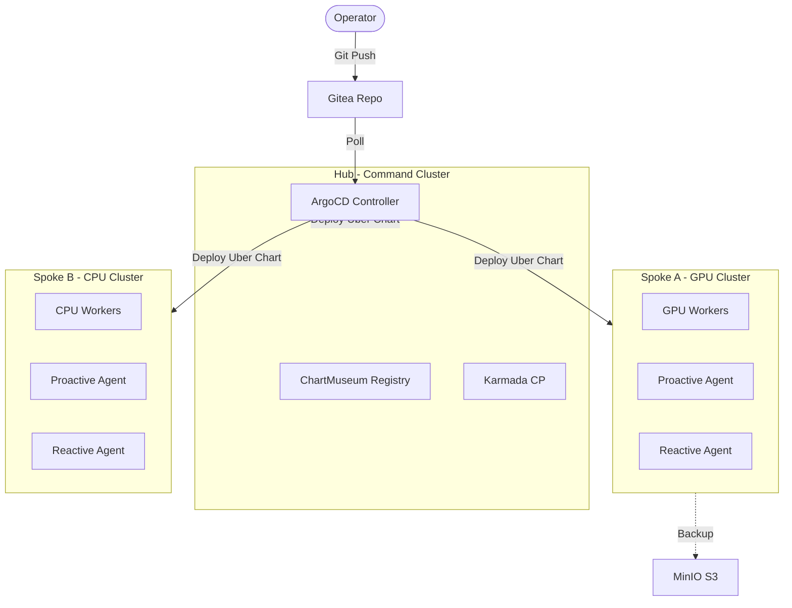
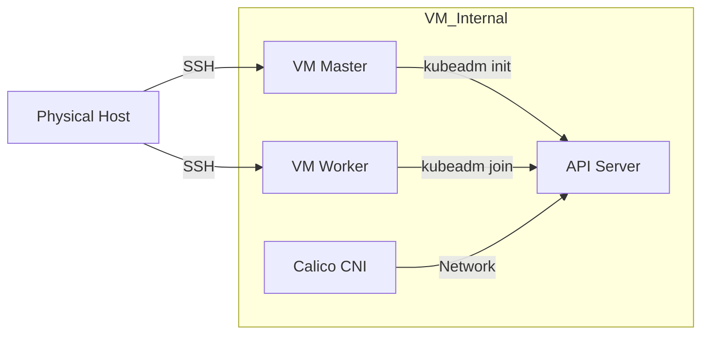
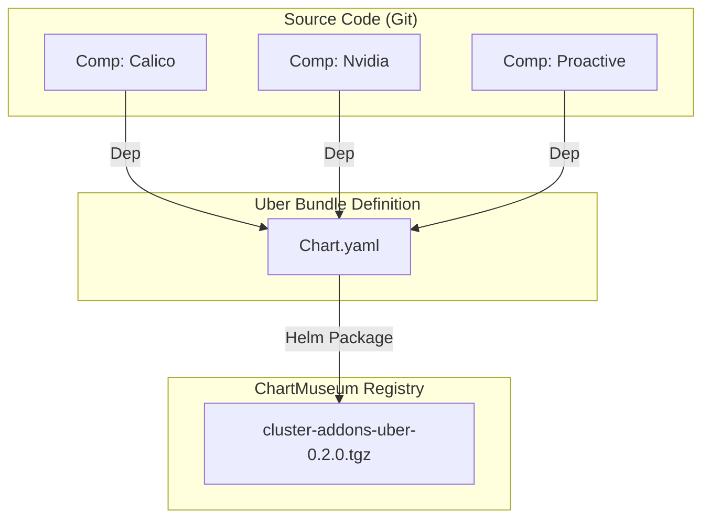
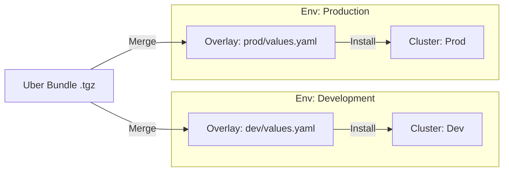
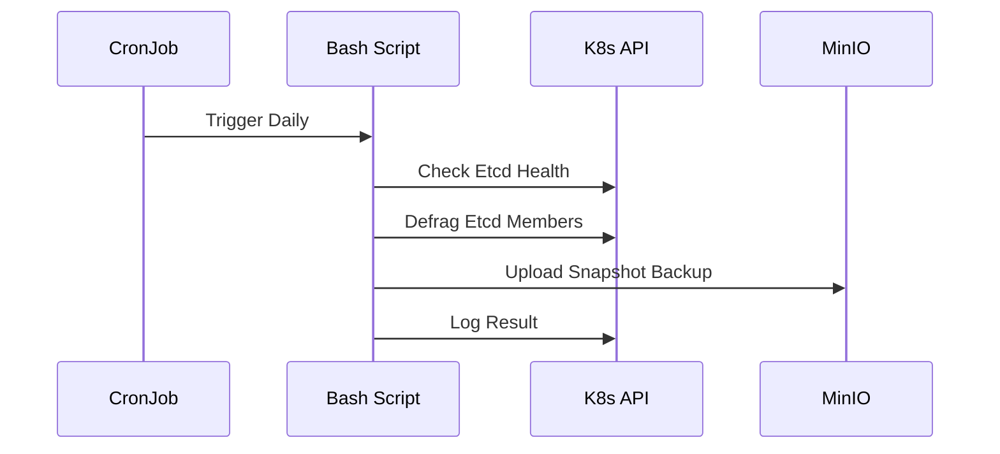

# K8s Infrastructure as Code (KVM, GitOps, SSOT Platform)

> **Version**: 1.0.0
> **Maintainer**: Platform Engineering Team
> **License**: MIT
> **Source**: [https://github.com/SrikantaDatta51/k8s-iac](https://github.com/SrikantaDatta51/k8s-iac)

---

## 📖 Table of Contents

1.  [Executive Summary](#1-executive-summary)
2.  [Design Philosophy](#2-design-philosophy)
3.  [Architecture & Topology](#3-architecture--topology)
4.  [Phase 1: Metal Provisioning (VM Creation)](#4-phase-1-metal-provisioning-vm-creation)
5.  [Phase 2: Cluster Bootstrap (K8s Install)](#5-phase-2-cluster-bootstrap-k8s-install)
6.  [Phase 3: Release Management (The Uber Strategy)](#6-phase-3-release-management-the-uber-strategy)
7.  [Phase 4: Proactive Management Suite](#7-phase-4-proactive-management-suite)
8.  [Phase 5: Reactive Self-Healing Suite](#8-phase-5-reactive-self-healing-suite)
9.  [Troubleshooting Guide](#9-troubleshooting-guide)

---

## 1. Executive Summary

Welcome to the **Kubernetes Infrastructure as Code** repository. This is not just a collection of Helm charts; it is a complete, production-grade **Platform Engineering reference architecture** for running Kubernetes on Bare Metal hardware.

When you work with this repo, you are acting as a **Principal Infrastructure Engineer**. You are responsible for the entire stack:
1.  **The Hardware**: You control the KVM Hypervisor and Virtual Machines.
2.  **The OS**: You control the Ubuntu kernel and networking.
3.  **The Platform**: You manage the "Uber Bundle" that provides capabilities to developers.
4.  **The Operations**: You rely on Proactive/Reactive agents, not 3am pagers.

### Why is this Repo Different?
Most tutorials assume you have EKS or GKE. We assume **you have nothing but a Linux server**. We build the world from scratch.
*   We use **Libvirt/KVM** to create our own Cloud.
*   We use **ArgoCD** to ship immutable software.
*   **We do not patch.** We replace.

---

## 2. Design Philosophy

### The "Single Source of Truth" (SSOT)
In this platform, **Git is God**.
If a configuration exists on a server but not in this repo, it is a bug. It will be overwritten.
*   **Repo**: The desired state.
*   **Cluster**: The actual state.
*   **ArgoCD**: The loop that forces Actual == Desired.

### The "Fixed Fleet" Constraint
We are designing for an AI/ML environment (GPU Clusters).
*   **No Auto-Scaling**: You can't just "spin up" another A100 GPU node in the cloud. We have a fixed set of physical racks.
*   **High Availability**: Since we can't easily replace hardware, we must **Self-Heal** via software reboots and specific kernel remediation.

---

## 3. Architecture & Topology

We operate a **Hub-and-Spoke** model.

*   **Hub (Command Cluster)**: The Brain. Runs ArgoCD, ChartMuseum, Karmada. It tells the others what to do.
*   **Spokes**: The Muscle.
    *   **GPU Cluster**: Where AI Training happens (Infiniband, NVLink).
    *   **CPU Cluster**: Where routine Web Apps and APIs run.

### Global Diagram



### Network Topology
We use a **Bridged Network (`br0`)**. This means your VMs are on the *same* LAN as your host machine. They are not hiding behind a NAT. They are first-class citizens on the network.

| Node | IP Address | Role |
|---|---|---|
| `host` | `192.168.100.1` | Gateway / Physical Server |
| `cmd-master` | `...100.10` | Command Cluster Control Plane |
| `gpu-master` | `...100.20` | GPU Cluster Control Plane |
| `cpu-master` | `...100.30` | CPU Cluster Control Plane |

---

## 4. Phase 1: Metal Provisioning (VM Creation)

**Context**: You are sitting at the terminal of your fresh Ubuntu 22.04 Physical Server. You have nothing installed.

### Step 1: Clone and Inspect
First, get the code.
```bash
git clone https://github.com/SrikantaDatta51/k8s-iac.git
cd k8s-iac/vm-provisioning
```

### Step 2: The "Magic" Script
We have properly automated the `virt-install` commands. You do not need to manually configure CPUs or RAM.
Read `02-provision-all.sh`. It loops through our definitions.

**Action**: Run the provisioner.
```bash
# This will:
# 1. Create the 'k8s-net' bridge.
# 2. Download Ubuntu Cloud Images.
# 3. Spin up 9 Virtual Machines.
sudo ./02-provision-all.sh
```

### Step 3: Verification
Check if KVM is happy.
```bash
virsh list --all
# You should see:
# Id   Name             State
# --------------------------------
# 1    cmd-master       running
# 2    cmd-worker-1     running
# ...
```

Wait for them to boot (about 2 minutes).

---

## 5. Phase 2: Cluster Bootstrap (K8s Install)

**Context**: The VMs are running, but they are just empty Ubuntu boxes. We need to install Kubernetes (`kubeadm`).

### The Bootstrap Diagram



### Step 1: The Orchestrator
Go to the bootstrap folder.
```bash
cd ../cluster-bootstrap
```

We have a script `01-bootstrap-clusters.sh`.
**What it does**:
1.  Iterates through our clusters (`command`, `gpu`, `cpu`).
2.  SSHs into the Master Node.
3.  Runs `kubeadm init`, installs Calico, and saves the Join Token.
4.  SSHs into the Worker Nodes.
5.  Runs `kubeadm join` using that token.

**Action**:
```bash
# Verify you have SSH access first (keys are handled by cloud-init)
# Then run:
./01-bootstrap-clusters.sh
```

### Step 2: Validation
Log into the Command Master to verify.
```bash
ssh ubuntu@192.168.100.10
kubectl get nodes
# Expected:
# NAME           STATUS   ROLES           AGE     VERSION
# cmd-master     Ready    control-plane   2m      v1.28.0
# cmd-worker-1   Ready    <none>          1m      v1.28.0
```

---

## 6. Phase 3: Release Management (The Uber Strategy)

**Context**: In a distributed system, "Version Drift" is the enemy.
*   *Drift*: Dev has Promtail v2.1, Prod has Promtail v2.0.
*   *Drift*: Dev has Nvidia Driver 535, Prod has 525.

**The Solution**: We enforce a **Single Source of Truth (SSOT)** using the **Uber Bundle Pattern**.

### 6.1 The Stack Explained

| Concept | Directory | Description |
|---|---|---|
| **Component** | `components/addons/*` | A standard Helm chart for **ONE** tool (e.g., `gpu-operator`). It knows *how* to install the tool, but not *how to configure it* for specific environments. |
| **Uber Bundle** | `uber/cluster-addons-uber` | A "Meta-Chart". It has **NO Templates**. It only has a `Chart.yaml` with a list of `dependencies` pointing to Components. It represents the "Platform Version" (e.g., `v1.0`). |
| **Overlay** | `env/overlays/*` | The **Values-Only** layer. It contains `values.yaml` files that inject specific config (e.g., "ReplicaCount: 3") into the Uber Bundle. |

### 6.2 The "Build" Diagram (Composition)

Code becomes an Artifact.



### 6.3 The "Deploy" Diagram (Consumption)

Artifact + Config = Running Cluster.



### 6.4 Developer Guide: The Lifecycle of a Change

#### Scenario: "I need to increase Etcd Defrag frequency in Prod"

1.  **Locate the Config**: You do *not* touch code. You touch the **Overlay**.
    *   File: `cp-paas-iac-reference/env/overlays/prod/values-cluster-addons-uber.yaml`
2.  **Edit Values**:
    ```yaml
    proactive-management:
      config:
        etcd:
          schedule: "0 1 * * *" # Changed from 0 2
    ```
3.  **Commit**: Git Push to `main`.
4.  **Sync**: ArgoCD detects the change in the *Value File* and re-applies the *Same Artifact* (`0.2.0`) with *New Config*.

#### Scenario: "I want to upgrade the Nvidia Driver"

1.  **Touch Code**: You modify the **Component**.
    *   File: `components/addons/nvidia-gpu-operator/values.yaml` (Change tag to `535`).
2.  **Bump Component**: Update `components/addons/nvidia-gpu-operator/Chart.yaml` to `v0.5.0`.
3.  **Register Change**: Update `uber/cluster-addons-uber/Chart.yaml` dependency to version `0.5.0`.
4.  **Build**: CI builds new Uber Artifact `v0.2.1`.
5.  **Promote**:
    *   Update `env/overlays/dev/argocd-app.yaml` -> `targetRevision: 0.2.1`.
    *   *Verify in Dev.*
    *   Update `env/overlays/prod/argocd-app.yaml` -> `targetRevision: 0.2.1`.

---

## 7. Phase 4: Proactive Management Suite

**Context**: Clusters rot. Logs fill up. Certificates expire.
**Solution**: We run a "Janitor" stack in the `proactive-maintenance` namespace.

### Architecture



### Included Scenarios (The Service Catalog)

We include **10+ Standard Procedures** out of the box.

1.  **Etcd Snapshot (Daily)**: Encryption-at-rest backups to MinIO.
2.  **Etcd Defrag (Daily)**: Compacting the Key-Value store to keep API latency low.
3.  **Node Cleaner (Daily)**: `crictl rmi` to remove unused docker images.
4.  **Pod Hygiene (Hourly)**: Removes `Evicted` and `Error` pods that spam `kubectl get pods`.
5.  **Cert Auditor (Hourly)**: Warns 30 days before PKI expiration.
6.  **GPU Capacity (Hourly)**: Logs exactly how many A100s are idle vs used.
7.  **Velero UI**: A GUI dashboard (Port 3000) for managing backups.

### How to Run a Manual Checks
Don't wait for the schedule.
```bash
# Trigger the GPU check right now
kubectl create job --from=cronjob/hourly-gpu-capacity manual-check-1 -n proactive-maintenance

# Check the output
kubectl logs job/manual-check-1 -n proactive-maintenance
# Output: "Cluster has 8/16 GPUs available."
```

---

## 8. Phase 5: Reactive Self-Healing Suite

**Context**: AI Training jobs can freeze the Linux Kernel. A standard Kubernetes LivenessProbe is not enough (the Kubelet itself might be dead).
**Solution**: **Medik8s + Node Problem Detector**.

### The Remediation Loop Diagram

```mermaid
graph TD
    Kernel[Linux Kernel] -->|Error Log| Log[/dev/kmsg]
    Log -->|Regex Match| NPD[Node Problem Detector]
    NPD -->|Condition=True| Node[Node Object]
    
    Node -->|Watch| NHC[Node Health Check Op]
    NHC -->|Create| CR[NodeRemediation CR]
    CR -->|Trigger| SNR[Self Node Remediation]
    SNR -->|Reboot| Host[System Reboot]
```

### The Scenario Matrix

We catch **12 specific Hard Failures**:

| Scenario ID | Name | Trigger Pattern | Why Reboot? |
|---|---|---|---|
| **R-01** | **KernelDeadlock** | `task blocked > 120s` | CPU scheduler is hung. Soft restart impossible. |
| **R-02** | **ReadonlyFS** | `Remounting fs read-only` | Disk corruption protection. Reboot forces fsck. |
| **R-03** | **OOMKiller** | `Out of memory: Kill process` | RAM is exhausted. |
| **R-11** | **InfinibandDown** | `mlx5_core.*Link is down` | **New!** AI Networking card failure. Resets PCIe bus. |
| **R-12** | **NCCLFailure** | `NCCL WARN` | **New!** GPU Interconnect hang during training. |

### How to Simulate a Failure (Do not do this in Prod!)
We can "trick" the system into thinking the Kernel is dead.

1.  **Log into a worker node**:
    ```bash
    ssh ubuntu@192.168.100.21
    ```
2.  **Inject the Poison Pill**:
    ```bash
    # This writes a fake kernel error to the log
    echo "kernel: task blocked for more than 120 seconds" | sudo tee /dev/kmsg
    ```
3.  **Watch the Fireworks**:
    Back on the master:
    ```bash
    kubectl get nodehealthcheck
    # You will see the node become "Cordoned", then the pods "Drained", then the node "Rebooted".
    ```

---

## 9. Troubleshooting Guide

### "I can't connect to Velero UI"
*   **Check**: Is the pod running? `kubectl get pods -n proactive-maintenance`.
*   **Port Forward**: You must forward the port manually if you are outside the cluster.
    ```bash
    kubectl port-forward svc/velero-ui -n proactive-maintenance 3000:3000
    ```
*   **Open**: `http://localhost:3000`.

### "The Bootsrap script fails at SSH"
*   **Check**: Did the VMs finish booting? Run `virsh list` and look at uptime.
*   **Check**: Is the bridge correct? `ip addr show br0`. It must be `192.168.100.1`.

### "ArgoCD won't sync"
*   **Check**: ChartMuseum. `kubectl get pods -n command-system`.
*   **Check**: The Repo URL in `env/overlays/dev/argocd-app.yaml`. Since we use self-signed certs or HTTP, ensure `insecure: true` is set in Argo config if needed.

---
**End of Operational Manual**
