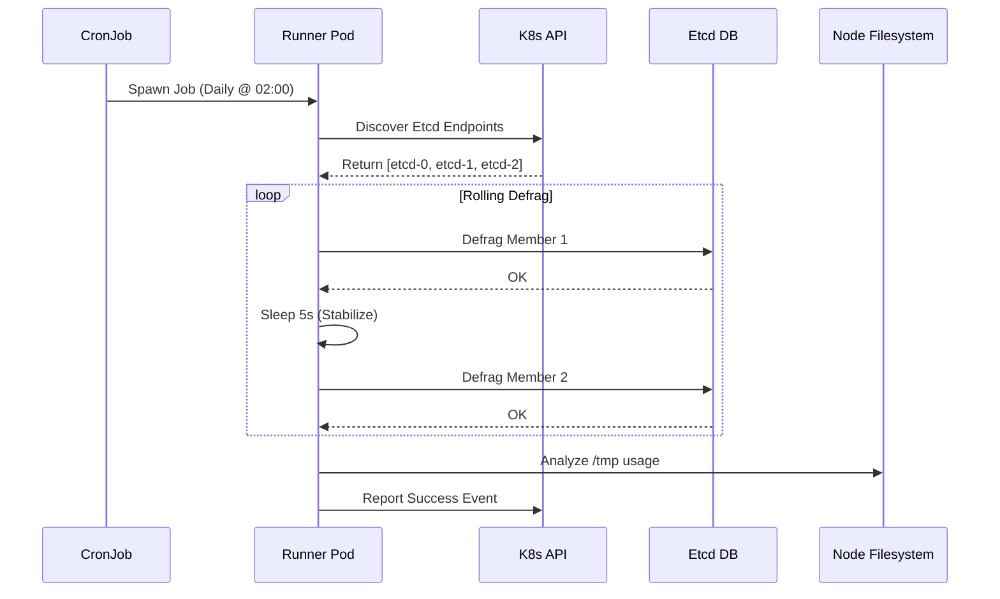

# K8s Infrastructure as Code (KVM, GitOps, Self-Healing)

> **Version**: 1.0.0
> **Maintainer**: Platform Engineering Team
> **License**: MIT
> **Source**: [GitHub Repository](https://github.com/SrikantaDatta51/k8s-iac)

---

## 📖 Table of Contents

1.  [Executive Summary](#1-executive-summary)
2.  [Design Philosophy & Principles](#2-design-philosophy--principles)
3.  [Architecture Deep Dive](#3-architecture-deep-dive)
    *   [3.1 Global Topology (Hub-Spoke)](#31-global-topology-hub-spoke)
    *   [3.2 Network Architecture (KVM/Bridge)](#32-network-architecture-kvmbridge)
    *   [3.3 Component Interaction Diagram](#33-component-interaction-diagram)
4.  [Repository Structure & Standards](#4-repository-structure--standards)
5.  [Release Management (The SSOT Model)](#5-release-management-the-ssot-model)
    *   [5.1 The Uber Chart Strategy](#51-the-uber-chart-strategy)
    *   [5.2 CI/CD Pipeline Flow](#52-cicd-pipeline-flow)
    *   [5.3 Versioning Policy](#53-versioning-policy)
6.  [Core Feature: Proactive Management](#6-core-feature-proactive-management)
    *   [6.1 Service Catalog](#61-service-catalog)
    *   [6.2 Technical Implementation](#62-technical-implementation)
7.  [Core Feature: Reactive Self-Healing](#7-core-feature-reactive-self-healing)
    *   [7.1 Remediation State Machine](#71-remediation-state-machine)
    *   [7.2 Scenario Matrix](#72-scenario-matrix)
8.  [Prerequisites & Hardware](#8-prerequisites--hardware)
9.  [Zero-to-Hero Quick Start](#9-zero-to-hero-quick-start)
    *   [Phase 1: Bare Metal Provisioning](#phase-1-bare-metal-provisioning)
    *   [Phase 2: Cluster Bootstrap](#phase-2-cluster-bootstrap)
    *   [Phase 3: Platform Deployment](#phase-3-platform-deployment)
10. [Operational Runbooks](#10-operational-runbooks)
    *   [RB-01: Accessing Velero UI](#rb-01-accessing-velero-ui)
    *   [RB-02: Manual Etcd Defrag](#rb-02-manual-etcd-defrag)
    *   [RB-03: Simulating Kernel Panic](#rb-03-simulating-kernel-panic)
    *   [RB-04: Disaster Recovery (Etcd Restore)](#rb-04-disaster-recovery-etcd-restore)
11. [Troubleshooting FAQ](#11-troubleshooting-faq)

---

## 1. Executive Summary

This project represents a **Principal-Reference Architecture** for operating Kubernetes on bare-metal hardware. Unlike managed cloud services (EKS/GKE), this platform provides total control over the virtualization layer (`libvirt/KVM`), the operating system (`Ubuntu`), and the Kubernetes control plane.

To manage the complexity of "Day-2 Operations", we introduce two novel suites:
1.  **Proactive Management**: A suite of recurring CronJobs that prevent "Bit Rot" (e.g., reclaiming disk space, defragmenting Etcd).
2.  **Reactive Management**: A self-healing "Immune System" that reboots nodes when they enter unrecoverable states (e.g., Kernel Deadlocks).

All configurations are managed via **GitOps** (ArgoCD) using a **Single Source of Truth (SSOT)** architectural pattern.

---

## 2. Design Philosophy & Principles

### Why Bare Metal KVM?
*   **Performance**: Direct access to Hardware Performance Counters and GPU Passthrough (PCIe).
*   **Cost**: No cloud vendor markup on compute/storage.
*   **Isolation**: Hard multi-tenancy boundaries using distinct Virtual Machines.

### The "Janitor" Principle
Kubernetes clusters degrade over time. Logs fill disks, Etcd fragments, and certificates expire.
*   *Old Way*: Wait for a pager alert at 3 AM.
*   *New Way*: **Proactive CronJobs** run daily to clean, prune, and verify the cluster state.

### The "Immune System" Principle
Some failures (Kernel frozen, Filesystem Read-Only) cannot be fixed by Kubernetes Controllers.
*   *Old Way*: Manual SSH and Reboot.
*   *New Way*: **Node Problem Detector** captures the kernel signal -> **Medik8s Operator** initiates a safe reboot (Drain -> Reboot -> Uncordon).

---

## 3. Architecture Deep Dive

### 3.1 Global Topology (Hub-Spoke)
The system is composed of three distinct clusters to separate concerns.

```mermaid
graph TD
    classDef hub fill:#f9f,stroke:#333,stroke-width:2px;
    classDef spoke fill:#bbf,stroke:#333,stroke-width:2px;

    User([Platform Engineer]) -->|Git Push| Git[Gitea / GitHub]
    
    subgraph "Command Cluster (Hub)"
        direction TB
        Argo[ArgoCD]
        ChartM[ChartMuseum]
        Karmada[Karmada]
    end
    class Argo,ChartM,Karmada hub;
    
    subgraph "GPU Cluster (Spoke A)"
        GPU1[GPU Node 1]
        GPU2[GPU Node 2]
        P_A[Proactive Agents]
        R_A[Reactive Agents]
    end
    class GPU1,GPU2 spoke;
    
    subgraph "CPU Cluster (Spoke B)"
        CPU1[CPU Node 1]
        CPU2[CPU Node 2]
        P_B[Proactive Agents]
        R_B[Reactive Agents]
    end
    class CPU1,CPU2 spoke;
    
    Git -->|Webhook| Argo
    Argo -->|Sync App| GPU Cluster
    Argo -->|Sync App| CPU Cluster
    
    GPU1 -.->|Backup| MinIO[Shared Object Storage]
```

### 3.2 Network Architecture (KVM/Bridge)
We utilize a **Bridged Network** topology to allow VMs to appear as first-class citizens on the host network.

*   **Host Bridge (`br0`)**: Connects physical eth0 to VMs.
*   **Gateway**: 192.168.100.1
*   **Range**: 192.168.100.0/24

| Node Type | IP Range | Description |
|---|---|---|
| **Gateway** | `.1` | Physical Router / Host |
| **Services** | `.10` | LoadBalancer VIPs |
| **Command Cluster** | `.30 - .39` | Management Plane |
| **GPU Cluster** | `.20 - .29` | AI/ML Workloads |
| **CPU Cluster** | `.40 - .49` | General Purpose |

### 3.3 Component Interaction Diagram
How the **Proactive Suite** interacts with the Cluster Internals:



---

## 4. Repository Structure & Standards

```tree
k8s-iac/
├── cluster-bootstrap/           # [Layer 1] VM & K8s Installation Scripts
│   ├── install-prereqs.sh       # Apt packages (containerd, kubeadm)
│   ├── manage-cluster.sh        # Kubeadm init/join application
│   └── install-gpu.sh           # Nvidia Drivers & Toolkit
├── cluster-configs/             # [Layer 2] Day-2 Manifests (Argo, Calico)
│   ├── command-cluster/         # Hub Apps (Gitea, ChartMuseum)
│   └── gpu-cluster/             # Spoke Apps (Nvidia Plugin)
├── cp-paas-iac-reference/       # [Layer 3] The Platform Product
│   ├── charts/                  # SOURCE CODE for Helm Charts
│   │   ├── proactive-management/
│   │   └── reactive-management/
│   ├── components/              # Reusable Library Charts
│   │   ├── addons/              # CNI, GPU, Multus
│   │   └── tenants/             # Namespace & Quota Templates
│   ├── uber/                    # SINGLE SOURCE OF TRUTH
│   │   └── cluster-addons-uber/ # The Aggregator Chart
│   └── env/                     # ENVIRONMENT CONFIGURATION
│       └── overlays/            # Values.yaml per Env
│           ├── dev/
│           ├── staging/
│           └── prod/
└── docs/                        # Architecture Decisions & Runbooks
```

---

## 5. Release Management (The SSOT Model)

### 5.1 The Uber Chart Strategy
To prevent configuration drift between Dev and Prod, we adopt the **Uber Chart** pattern.
*   **Concept**: We do NOT deploy 20 separate Helm charts. We deploy **ONE** chart (`cluster-addons-uber`) that lists the others as dependencies.
*   **Result**: A release is atomic. `v0.2.0` contains specifically `proactive-v1.2` and `reactive-v1.1`.

### 5.2 CI/CD Pipeline Flow
1.  **Developer** pushes code to `main`.
2.  **CI Script** (`ci/build-and-publish-uber.sh`) runs:
    *   Detects changes in sub-charts.
    *   Packages sub-charts (`helm package`).
    *   Updates `pkgs/uber/Chart.yaml` dependencies.
    *   Bumps Uber Chart version (e.g., `0.1.4` -> `0.1.5`).
    *   Publishes to **ChartMuseum**.
3.  **ArgoCD** polls ChartMuseum.
4.  **Operator** promotes the version in `env/overlays/prod/argocd-app.yaml`.

### 5.3 Versioning Policy
*   **Major (1.0.0)**: Breaking Architecture Change.
*   **Minor (0.2.0)**: New Feature (e.g., added Reactive Suite).
*   **Patch (0.1.5)**: Bug fix in a script or config.

---

## 6. Core Feature: Proactive Management
*Maintainer: Platform Team | Namespace: `proactive-maintenance`*

### 6.1 Service Catalog
| Job Name | Schedule | Impact | Description |
|---|---|---|---|
| `etcd-snapshot` | `0 1 * * *` | High | Takes S3/MinIO snapshot of Etcd. Validates via checksum. |
| `etcd-defrag` | `30 2 * * *` | High | Reclaims disk space from MVCC database. Improves API latency. |
| `node-cleaner` | `0 4 * * *` | Med | Prunes unused docker images (>24h old) and `/tmp` files. |
| `stuck-ns` | `0 5 * * *` | Low | Alerts on Namespaces stuck in `Terminating` > 1 hour. |
| `pod-hygiene` | Hourly | Low | Force-deletes `Evicted` pods and `Terminating` zombies. |
| **Velero UI** | Daemon | N/A | Web Interface for managing backups (Port 3000). |

### 6.2 Technical Implementation
All logic is encapsulated in `maintenance-scripts.yaml`.
*   **Language**: Bash (Strict Mode `set -euo pipefail`).
*   **Dependencies**: Script runners use a custom image with `kubectl`, `etcdctl`, `jq`, `openssl`.
*   **Config**: All variables (Endpoints, Thresholds) are injected via `values.yaml`.

---

## 7. Core Feature: Reactive Self-Healing
*Maintainer: SRE Team | Namespace: `reactive-maintenance`*

### 7.1 Remediation State Machine
When a node failure is detected, the **Medik8s Self Node Remediation (SNR)** operator follows strict safety gates:
1.  **Detection**: Condition `KernelDeadlock=True` persists for 5 minutes.
2.  **Quorum Check**: Is the cluster healthy enough? (`minHealthy=51%`).
3.  **Isolation**: Cordon the Node (No new pods).
4.  **Drain**: Evict safe pods (Respect PDBs).
5.  **Reboot**: Trigger Watchdog/Systemd Reboot.
6.  **Recovery**: Uncordon node after Kubelet reports Ready.

### 7.2 Scenario Matrix
We monitor 11 specific failure modes using **Node Problem Detector** regex.

| Scenario | Trigger Log (Regex) | Root Cause | Remediation |
|---|---|---|---|
| **KernelDeadlock** | `task blocked for more than 120 seconds` | OS Freeze / Driver Lock | **Reboot** |
| **ReadonlyFS** | `Remounting filesystem read-only` | Disk Failure / Corruption | **Reboot** |
| **OOMKiller** | `Out of memory: Kill process` | Memory Starvation | **Reboot** |
| **Ext4Error** | `EXT4-fs error` | Filesystem Inconsistency | **Reboot** |
| **DockerHung** | `failed to register layer` | Overlay2 Corruption | **Reboot** |

---

## 8. Prerequisites & Hardware

### Host Specifications
*   **Bare Metal**: Required for KVM efficiency.
*   **RAM**: 64GB+ Recommended (32GB Minimum).
*   **CPU**: 8+ Cores (AMD Ryzen / Intel Xeon).
*   **Disk**: 500GB NVMe (Etcd is latency sensitive).

### Software Requirements
*   **OS**: Ubuntu 22.04 LTS.
*   **Hypervisor**: `qemu-kvm`, `libvirt-daemon-system`.
*   **Client Tools**: `kubectl`, `helm`, `virt-manager`.

---

## 9. Zero-to-Hero Quick Start

### Phase 1: Bare Metal Provisioning
Scripts located in `vm-provisioning/`.

1.  **Configure Network**:
    ```bash
    cd vm-provisioning
    sudo ./00-setup-host-net.sh
    # Verifies bridge br0 exists and IP forwarding is enabled
    ```
2.  **Provision VMs**:
    ```bash
    sudo ./02-provision-all.sh
    # Creates:
    # - command-cp, command-worker
    # - gpu-cp, gpu-worker, gpu-worker-gpu
    # - cpu-cp, cpu-worker-1, cpu-worker-2
    ```

### Phase 2: Cluster Bootstrap
Scripts located in `cluster-bootstrap/`.

1.  **Bootstrap Master**:
    ```bash
    ssh ubuntu@192.168.100.30  # Command Master
    sudo ./manage-cluster.sh init
    # Copy the 'kubeadm join' token output!
    ```
2.  **Join Workers**:
    ```bash
    ssh ubuntu@192.168.100.31
    sudo kubeadm join 192.168.100.30:6443 --token <token> ...
    ```

### Phase 3: Platform Deployment
Scripts located in `cp-paas-iac-reference/`.

1.  **Install ArgoCD (Command Cluster)**:
    ```bash
    kubectl create ns argocd
    kubectl apply -f cluster-configs/command-cluster/argocd-install.yaml
    ```
2.  **Deploy Uber Chart (Dev)**:
    ```bash
    kubectl apply -f env/overlays/dev/argocd-app.yaml
    ```

---

## 10. Operational Runbooks

### RB-01: Accessing Velero UI
**Context**: You need to restore a backup or verify nightly snapshots.
1.  **Port Forward**:
    ```bash
    kubectl port-forward svc/velero-ui -n proactive-maintenance 8090:3000
    ```
2.  **Login**: `http://localhost:8090` (User: `admin` / Pass: `admin`).

### RB-02: Manual Etcd Defrag
**Context**: Etcd database size alert triggers (>2GB).
1.  **Trigger Job**:
    ```bash
    kubectl create job --from=cronjob/etcd-defrag-rolling manual-defrag-001 -n proactive-maintenance
    ```
2.  **Watch Logs**:
    ```bash
    kubectl logs -f job/manual-defrag-001 -n proactive-maintenance
    # Expect: "Defragging member..." -> "Complete"
    ```

### RB-03: Simulating Kernel Panic
**Context**: Verifying Reactive Remediation pipeline.
1.  **Log Injection**:
    ```bash
    ssh ubuntu@<worker-node-ip>
    echo "kernel: task blocked for more than 120 seconds" | sudo tee /dev/kmsg
    ```
2.  **Verification**:
    ```bash
    kubectl get nodehealthcheck
    kubectl get events -n reactive-maintenance --sort-by='.lastTimestamp'
    # Look for "RemediationCreated"
    ```

### RB-04: Disaster Recovery (Etcd Restore)
**Context**: Total cluster failure. API Server not starting.
1.  **Stop Static Pods**: Move manifests out of `/etc/kubernetes/manifests`.
2.  **Download Snapshot**: Get latest `.db` file from MinIO/S3.
3.  **Restore Command**:
    ```bash
    ETCDCTL_API=3 etcdctl snapshot restore /backup/snapshot.db \
      --data-dir /var/lib/etcd-new
    ```
4.  **Restart**: Update static pod manifest to point to `/var/lib/etcd-new`.

---

## 11. Troubleshooting FAQ

**Q: My VMs don't have internet access.**
**A**: Check Host machine NAT rules. Ensure `net.ipv4.ip_forward=1`. Verify `br0` configuration.

**Q: Reactive Remediation is ensuring the node is cordoned but not rebooting.**
**A**: Check `minHealthy`. If you only have 2 nodes and one is down, Medik8s might pause remediation to preserve quorum (51%).

**Q: Velero Backup is stuck in "InProgress".**
**A**: Verify MinIO connectivity.
```bash
kubectl run -it --rm debug --image=curlimages/curl -- \
  curl http://minio.proactive-maintenance.svc:9000
```
