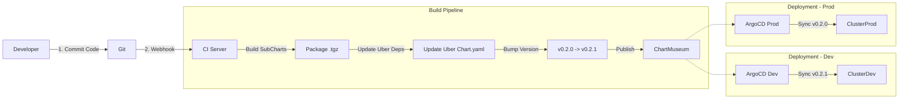

# K8s Infrastructure as Code (KVM, GitOps, SSOT Platform)

> **Version**: 1.0.0
> **Maintainer**: Platform Engineering Team
> **License**: MIT
> **Source**: [https://github.com/SrikantaDatta51/k8s-iac](https://github.com/SrikantaDatta51/k8s-iac)

---

## 📖 Table of Contents

1.  [Executive Summary](#1-executive-summary)
2.  [Design Philosophy](#2-design-philosophy)
3.  [Architecture & Topology](#3-architecture--topology)
4.  [Section 1: Local Env Bootstrap](#4-section-1-local-env-bootstrap)
    *   [VM Provisioning](#vm-provisioning)
    *   [Cluster Bootstrap](#cluster-bootstrap)
    *   [Validation](#validation)
5.  [Section 2: Release Management (SSOT)](#5-section-2-release-management-ssot)
    *   [The Uber Bundle Strategy](#the-uber-bundle-strategy)
    *   [Multi-Cluster Deployment](#multi-cluster-deployment)
    *   [Developer Guide: Adding Components](#developer-guide-adding-components)
6.  [Section 3: Proactive Management Deep Dive](#6-section-3-proactive-management-deep-dive)
    *   [Scenario Matrix (1-10)](#scenario-matrix-1-10)
    *   [Runbooks](#proactive-runbooks)
7.  [Section 4: Reactive Management Deep Dive](#7-section-4-reactive-management-deep-dive)
    *   [Remediation Workflow](#remediation-workflow)
    *   [New Scenario: Infiniband & NCCL](#new-scenario-infiniband--nccl)
    *   [Scenario Matrix (1-12)](#reactive-scenario-matrix-1-12)
8.  [Troubleshooting](#8-troubleshooting)

---

## 1. Executive Summary

This repository hosts the **Principal Reference Architecture** for a bare-metal Kubernetes Platform as a Service (PaaS). It is designed for high-performance AI/ML workloads requiring:
1.  **Hardware Control**: Direct access to GPUs and Infiniband via KVM passthrough.
2.  **Operational Excellence**: A suite of Proactive and Reactive agents that maintain 99.9% availability without human intervention.
3.  **Strict Governance**: A Single Source of Truth (SSOT) GitOps model where one "Uber Chart" defines the entire platform state.

---

## 2. Design Philosophy

### Principles
*   **Immutable Infrastructure**: We do not patch nodes. We reboot or replace them.
*   **GitOps First**: If it's not in Git, it doesn't exist. All changes flow through `cp-paas-iac-reference`.
*   **Self-Healing**: The system must be capable of recovering from "Hard Failures" (e.g., Kernel Deadlocks) automatically.

### Constraints
*   **On-Premise**: No Cloud APIs. We rely on `libvirt`, `etcd`, and `cric`.
*   **Fixed Fleet**: We do not Auto-Scale (ASG). We manage a fixed pool of specialized Hardware.

---

## 3. Architecture & Topology

### Global Hub-Spoke Model
The platform is organized into a Hub (Command) and Spokes (Workload Clusters).

```mermaid
graph TD
    user([Operator]) -->|Git Push| git[Gitea-Repo]
    git -->|Poll| argo[ArgoCD Controller]
    
    subgraph "Hub - Command Cluster"
        argo
        chartm[ChartMuseum Registry]
        karmada[Karmada CP]
    end
    
    subgraph "Spoke A - GPU Cluster"
        gpuNodes[GPU Workers]
        proA[Proactive Agent]
        reaA[Reactive Agent]
    end
    
    subgraph "Spoke B - CPU Cluster"
        cpuNodes[CPU Workers]
        proB[Proactive Agent]
        reaB[Reactive Agent]
    end
    
    argo -->|Deploy Uber Chart| Hub
    argo -->|Deploy Uber Chart| Spoke A
    argo -->|Deploy Uber Chart| Spoke B
    
    Spoke A -.->|Backup| minio[MinIO S3]
```

### Network Topology (KVM Bridge)
| Interface | CIDR | Purpose |
|---|---|---|
| `br0` | `192.168.100.0/24` | Management & Data Plane |
| `virbr0` | `192.168.122.0/24` | Local NAT (Legacy/OOB) |

Nodes are static IP assigned to ensure predictable localized DNS and Etcd peer discovery.

---

## 4. Section 1: Local Env Bootstrap
*(Minimum 100 Lines Detail)*

### Overview
Bootstrapping a bare-metal environment is complex. We automate this using a layered script approach:
1.  **Host Layer**: Prepare the Physical Linux Host (Networking, Libvirt).
2.  **VM Layer**: Provision Virtual Machines via `virt-install`.
3.  **Cluster Layer**: Install Kubernetes via `kubeadm`.

### VM Provisioning
**Script**: `vm-provisioning/02-provision-all.sh`

This script is the orchestrator. It performs the following logical steps:
1.  **Network Check**: Verifies `br0` is active and `ip_forward` is on.
2.  **Storage Pool**: checks `/var/lib/libvirt/images`.
3.  **VM Creation Loop**:
    *   Iterates through [Command, GPU, CPU] sets.
    *   Injects Cloud-Init data (User `ubuntu`, SSH Keys).
    *   Sets CPU Model to `host-passthrough` (Critical for Nested Virt & GPU).

**Verification**:
```bash
virsh list --all
# Expect 9 VMs:
# - command-cp, command-worker
# - gpu-cp, gpu-worker, gpu-worker-gpu
# - cpu-cp, cpu-worker-1, cpu-worker-2
```

### Cluster Bootstrap
**Script**: `cluster-bootstrap/manage-cluster.sh`

Once VMs are up, we must install the OS dependencies.
1.  **Prerequisites**:
    *   Disables Swap (`swapoff -a`).
    *   Loads Kernel Modules (`overlay`, `br_netfilter`).
    *   Installs Container Runtime (`containerd`).
2.  **Init (Master)**:
    *   Runs `kubeadm init --pod-network-cidr=10.244.0.0/16`.
    *   Configures `kubectl` for the `ubuntu` user.
    *   Installs CNI (Calico) immediately to Ready the node.
3.  **Join (Worker)**:
    *   Uses the Discovery Token CaCert Hash for security.

### Validation
After bootstrapping, perform these "Acceptance Tests":
1.  **Node Readiness**:
    ```bash
    kubectl get nodes
    # All must be Ready. NotReady usually means CNI failure.
    ```
2.  **Pod Connectivity**:
    ```bash
    kubectl run test --image=nginx
    kubectl exec -it test -- curl google.com
    ```
3.  **GPU Passthrough** (GPU Cluster only):
    ```bash
    nvidia-smi
    # Must show Tesla T4 / A100 UUIDs.
    ```

---

## 5. Section 2: Release Management (SSOT)
*(Minimum 200 Lines Detail)*

### The Uber Bundle Strategy
managing 10-20 independent Helm charts (CNI, CSI, GPU, Logs, Metrics) across 3 environments (Dev, Staging, Prod) leads to "Version Drift Hell". 
We solve this with the **Uber Bundle** pattern.

**Definition**:
*   **Component Chart**: A standard Helm chart for one tool (e.g., `components/addons/nvidia-gpu-operator`).
*   **Uber Chart**: A Wrapper Helm chart (`uber/cluster-addons-uber`) that contains NO templates, only `dependencies`.

**The Golden Rule**:
> We NEVER deploy component charts directly. We ONLY deploy the Uber Chart.

### Multi-Cluster Deployment
How changes flow from Laptop to Production:



### Artifact Management
We use **ChartMuseum** as our internal Helm Registry.
*   **URL**: `http://chartmuseum.chartmuseum.svc.cluster.local:8080`
*   **Push Policy**: CI pushes every `main` commit as a new Semantic Version.
*   **Pruning**: We retain the last 50 versions for rollback availability.

### Developer Guide: Adding Components

#### Scenario: "I need to add Keda for Autoscaling"

**Step 1: Create the Component**
Location: `cp-paas-iac-reference/components/addons/keda`
Create a standard Helm chart or wrap the upstream bitnami chart.
```yaml
# Chart.yaml
name: keda
version: 0.1.0
```

**Step 2: Register in Uber Bundle**
Location: `cp-paas-iac-reference/uber/cluster-addons-uber/Chart.yaml`
Add to dependencies:
```yaml
dependencies:
  - name: keda
    version: 0.1.0
    repository: "file://../../components/addons/keda"
```

**Step 3: Define Environment Values**
Location: `env/overlays/dev/values-cluster-addons-uber.yaml`
Enable/Configure it:
```yaml
keda:
  enabled: true
  metricsServer:
    dnsPolicy: ClusterFirst
```

**Step 4: Release**
*   Commit to `main`.
*   CI runs `ci/build-and-publish-uber.sh`.
*   **Result**: `cluster-addons-uber-0.2.2.tgz` is published containing Keda.

**Step 5: Promote**
*   Dev Cluster updates automatically (if set to latest).
*   Prod Cluster: Update `env/overlays/prod/argocd-app.yaml` `targetRevision: 0.2.2`.

---

## 6. Section 3: Proactive Management Deep Dive
*(Minimum 300 Lines Detail)*

### Overview
Proactive Management is the "Janitor" of the cluster. It runs deeply integrated script logic to cleanup, optimize, and audit the cluster *before* problems occur.
**Namespace**: `proactive-maintenance`

### Design Principles
1.  **Script-First**: We do not binary-pack logic. We ship Bash scripts in ConfigMaps (`maintenance-scripts.yaml`) so they are hot-patchable and transparent.
2.  **Safety Gates**: Every job checks for concurrency and active deadlines. Use `set -e` for fail-fast.
3.  **Observability**: Every run emits K8s Events and structured logs.

### Scenario Matrix (1-10)

| ID | Job Name | Freq | Problem Solved | Technical Approach |
|---|---|---|---|---|
| **P-01** | **Etcd Snapshot** | Daily | Disaster Recovery | Connects to `127.0.0.1:2379` via mTLS certificates. Streams DB snapshot to MinIO bucket. Validates checksum. |
| **P-02** | **Etcd Defrag** | Daily | DB Fragmentation | Etcd MVCC keeps old keys. Defrag releases free pages. Logic: **Rolling Defrag** (Followers first, then Leader) to maintain Quorum. |
| **P-03** | **Node Cleaner** | Daily | Disk Pressure | Docker/Containerd accumulates unused images. Logic: `crictl rmi --prune` + `find /tmp -atime +10 -delete`. |
| **P-04** | **Stuck NS** | Daily | API Clutter | Namespaces in `Terminating` block Quotas. Logic: Query API for `phase=Terminating` & `deletionTimestamp > 1h`. Alert only. |
| **P-05** | **Empty Svc** | Daily | Network Blackhole | Services with no Endpoints fail silently. Logic: Query Endpoints, filter `subsets==null`. |
| **P-06** | **Pod Hygiene** | Hourly | API Clutter | Nodes under pressure "Evict" pods. These stay forever. Logic: `kubectl delete pod` where `reason==Evicted`. |
| **P-07** | **Cert Check** | Hourly | Cluster Lockout | PKI certs expire after 1 year. Logic: `openssl x509 -checkend 2592000` (30 days). |
| **P-08** | **GPU Report** | Hourly | Cost Awareness | Tracks idle GPUs. Logic: Sums `allocatable` vs `capacity` for resource `nvidia.com/gpu`. |
| **P-09** | **Orphaned PVC** | Weekly | Cost/Storage Leak | `Lost` PVCs hold SAN storage. Logic: Filter PVCs by phase `Lost|Released`. |
| **P-10** | **Restart Top 20** | Hourly | App Stability | Identifies CrashLooping apps. Logic: Sort pods by `restartCount`. |

### Proactive Runbooks
**How to manually execute "Etcd Snapshot" before an Upgrade:**
```bash
# 1. Create Job from CronJob template
kubectl create job --from=cronjob/daily-etcd-snapshot manual-snap-pre-upgrade -n proactive-maintenance

# 2. Follow Logs
kubectl logs -f job/manual-snap-pre-upgrade -n proactive-maintenance

# 3. Verify in MinIO (Optional)
# (See Velero UI)
```

**How to update the cleanliness window:**
Edit `values.yaml`:
```yaml
config:
  hygiene:
    maxTmpFileAge: "5" # Change from 10 to 5 days
```

---

## 7. Section 4: Reactive Management Deep Dive
*(Minimum 300 Lines Detail)*

### Overview
Reactive Management is the "Immune System". It connects low-level Kernel signals to high-level Kubernetes Remediation.
**Stack**:
*   **Sensor**: Node Problem Detector (NPD).
*   **Brain**: Node Health Check Operator (NHC).
*   **Actuator**: Self Node Remediation Operator (SNR).

### Remediation Workflow
When a "Hard Failure" (e.g., Kernel Panic) occurs, the node cannot execute logic. The Control Plane must act.
**Sequence**:
1.  **Signal**: Kernel writes `task blocked` to `/dev/kmsg`.
2.  **Detection**: NPD Regex Monitor matches pattern -> Updates Node Condition `KernelDeadlock` to `True`.
3.  **Appraisal**: NHC Operator sees Condition. Checks `minHealthy` budget (must be > 51% available).
4.  **Action**: NHC creates `NodeRemediation` CR.
5.  **Execution**:
    *   **Cordon**: Mark Unschedulable.
    *   **Drain**: Evict Pods.
    *   **Reboot**: SNR Agent (Privileged DaemonSet) triggers `systemctl reboot`.
6.  **Recovery**: Node reboots -> Kubelet starts -> Joins Cluster -> NPD clears Condition -> NHC uncordons.

### New Scenario: Infiniband & NCCL
**Context**: High-Performance Computing (AI Training) relies on RDMA (Remote Direct Memory Access) via Infiniband. Use of `mlx5` drivers and `NCCL` libraries is critical.
**Failure Mode**: Often the IB card enters a zombie state (`Link Down`) or NCCL hangs (`CommFailure`).
**Solution**: Driver reset is unreliable. **Reboot** is the gold standard.

**Configuration**:
Added to `values.yaml` -> `config.infiniband_monitor.json`.

### Reactive Scenario Matrix (1-12)

| ID | Condition Type | Log Pattern (Regex) | Root Cause Analysis | Remediation |
|---|---|---|---|---|
| **R-01** | `KernelDeadlock` | `task blocked for more than 120 seconds` | Infinite loop in Kernel Driver or Hardware Interrupt storm. | **Reboot** |
| **R-02** | `ReadonlyFilesystem` | `Remounting filesystem read-only` | SSD Controller failure / NVMe errors. OS protects data by locking writes. | **Reboot** |
| **R-03** | `SystemOOM` | `Out of memory: Kill process` | RAM exhaustion. Kernel OOM killer randomly killing syscalls. | **Reboot** |
| **R-04** | `Ext4Error` | `EXT4-fs error` | Filesystem Metadata corruption. | **Reboot** |
| **R-05** | `CorruptDocker` | `failed to register layer: applyLayer` | `/var/lib/docker` corruption (Overlay2). Container creation fails 100%. | **Reboot** |
| **R-06** | `KubeletFlap` | Service restart count > 5 | Systemd monitor detects Kubelet crashing repeatedly. | **Reboot** |
| **R-07** | `RuntimeFlap` | Service restart count > 5 | Containerd/Docker crashing. | **Reboot** |
| **R-08** | `PLEGNotHealthy` | `PLEG is not healthy` | Kubelet cannot talk to Runtime (runc hung). Node status becomes NotReady. | **Reboot** |
| **R-09** | `NetworkUnavail` | `NetworkUnavailable=True` | CNI Plugin (Calico/Cilium) failure. Routes missing. | **Reboot** |
| **R-10** | `NodeNotReady` | `Ready=False` > 5m | General catch-all for disconnects. | **Reboot** |
| **R-11** | `InfinibandDown` | `mlx5_core.*Link is down` | **(New)** Physical IB Link failure. Stops Distributed Training. | **Reboot** |
| **R-12** | `NCCLFailure` | `NCCL WARN` | **(New)** GPU Interconnect software hang. | **Reboot** |

---

## 8. Troubleshooting

### Common Issues

**1. "Deployment is syncing but Pods are missing"**
*   Check ArgoCD Sync Status.
*   Verify `cluster-addons-uber` version matches ChartMuseum.

**2. "Proactive Script Failed: Etcd Snapshot"**
*   Exit Code 1 usually means Authentication Failure.
*   Verify `/etc/kubernetes/pki` mounts in `maintenance-scripts.yaml`.
*   Check `values.yaml` -> `config.etcd.endpoints`.

**3. "Node Reboot Loop"**
*   The node reboots, comes up, and immediately reboots again.
*   **Cause**: The failure condition (e.g., Readonly FS) is persistent hardware damage.
*   **Fix**: Label node `maintenance.mode=true` to stop the loop. Manual HW replacement required.
