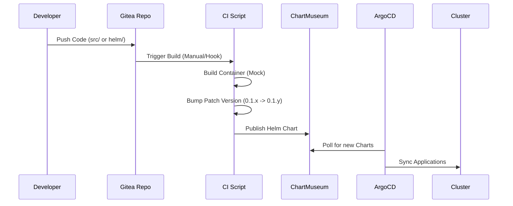
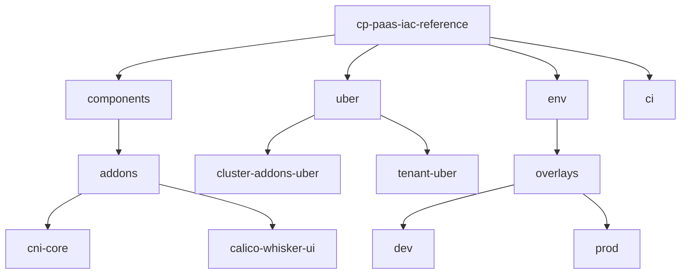
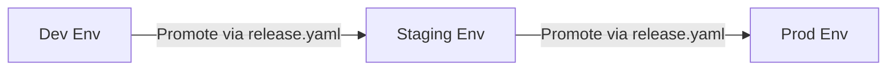

# User Manual: CP PaaS IaC Reference

This manual provides detailed, copy-paste instructions for managing the `cp-paas-iac-reference` monorepo.

## Table of Contents
1. [Architecture & Workflow](#1-architecture--workflow)
2. [Adding a New Component](#2-adding-a-new-component)
3. [Versioning & Automatic Builds](#3-versioning--automatic-builds)
4. [Promotion (Dev -> Staging -> Prod)](#4-promotion-workflow)
5. [Adding a New Environment](#5-adding-a-new-environment)
6. [Disaster Recovery](#6-disaster-recovery)
7. [Overlay Examples](#7-overlay-examples)

---

## 1. Architecture & Workflow

### Development Diagram


### Folder Structure


---

## 2. Adding a New Component

Use this workflow to add a new Addon or Tenant component.

**Step 2.1: Create Component Directory**
Run the following from the repo root:
```bash
# Replace 'my-component' with your component name
export COMPONENT_NAME="my-component"
mkdir -p components/addons/$COMPONENT_NAME/helm/$COMPONENT_NAME
mkdir -p components/addons/$COMPONENT_NAME/src
```

**Step 2.2: Initialize Helm Chart**
```bash
helm create components/addons/$COMPONENT_NAME/helm/$COMPONENT_NAME
# Clean up default templates if you want a blank slate
rm -rf components/addons/$COMPONENT_NAME/helm/$COMPONENT_NAME/templates/*
```

**Step 2.3: Update Uber Chart Dependencies**
Edit `uber/cluster-addons-uber/Chart.yaml` to include your new component.
```yaml
dependencies:
  - name: my-component
    version: 0.1.2 # Make sure to match the initial version
    repository: "file://../../components/addons/my-component/helm/my-component"
```

**Step 2.4: Update Dependencies**
```bash
helm dependency update uber/cluster-addons-uber
```

## 3. Versioning & Automatic Builds

The CI system automatically detects changes, builds source code, bumps chart versions, and publishes them.

**Triggering a Build**
Simply commit your changes. The CI script (`ci/build-components.sh`) checks for modified directories.

```bash
# Manually run the build script (simulating CI)
./ci/build-components.sh
./ci/build-and-publish-uber.sh
```

**How it works**:
1.  Detects changes in `src` or `helm`.
2.  Bumps the Patch version in `Chart.yaml` (e.g., `0.1.1` -> `0.1.2`).
3.  Packages the chart.
4.  Pushes to ChartMuseum (`http://192.168.100.10:30080`).

## 4. Promotion Workflow

Promotion is controlled by the `release.yaml` file (source of truth) or Environment Overlays.



**Step 4.1: Promote to Dev**
Edit `releases/release.yaml`:
```yaml
releases:
  dev:
    cluster-addons-uber: 0.1.5  # Update to new version
```
Then update the Dev Overlay `env/overlays/dev/values-cluster-addons-uber.yaml` if needed.
Commit and Push. ArgoCD syncs Dev.

## 5. Adding a New Environment

**Step 5.1: Clone Existing Overlay**
```bash
cp -r env/overlays/dev env/overlays/new-env
```

**Step 5.2: Customize Values**
Edit `env/overlays/new-env/values-*.yaml` to suit the new environment (e.g., quotas, replicas).

**Step 5.3: Create ArgoCD Apps**
Create `env/overlays/new-env/argocd-app.yaml`. Ensure you update the:
- `name` (e.g., `cluster-addons-uber-new-env`)
- `destination.server` (Cluster API URL)
- `source.helm.valueFiles` path

**Step 5.4: Deploy**
```bash
kubectl apply -f env/overlays/new-env/argocd-app.yaml
```

## 6. Disaster Recovery

**Restoring Gitea Access**
If the admin password is lost or the pod is reset:
```bash
# Exec into Gitea pod
kubectl exec -n gitea -it $(kubectl get pod -n gitea -l app=gitea -o name) -- /bin/bash

# Switch to git user
su git

# Reset Password
gitea admin user change-password -u gitea_admin -p 'NewPassword123!'
```

## 7. Overlay Examples

**Dev Overlay (`env/overlays/dev/values-tenant-uber.yaml`)**
```yaml
tenant-onboarding:
  enabled: true
  tenants:
    - name: team-dev
      namespace: team-dev
      quotas: # Lower quotas for Dev
        cpu: "10"
        memory: "10Gi"
```
