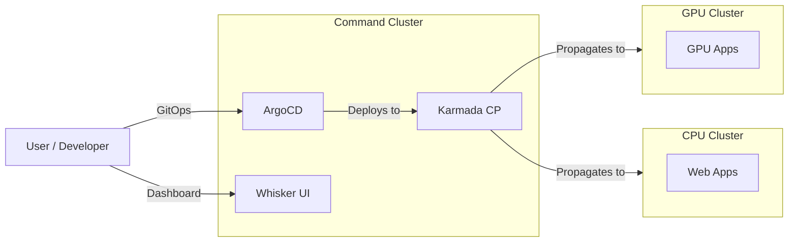
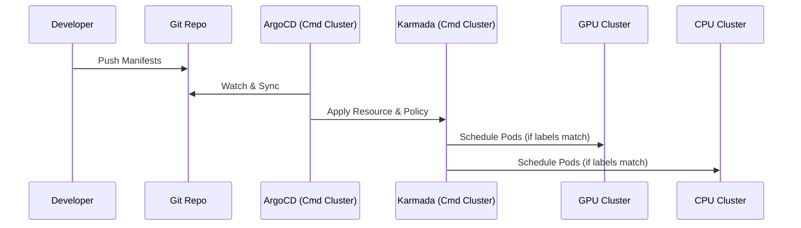

# KVM Kubernetes Architecture

## System Overview
The system consists of three Kubernetes clusters running as KVM Virtual Machines on a single Linux host. They are interconnected via a private bridge network (`192.168.100.0/24`).


```mermaid
graph TD
    subgraph Host [Linux Host - Precision 5820]
        direction TB
        subgraph Net [K8s Network (192.168.100.0/24)]
            Gw(Gateway .1)
        end

        subgraph CmdCluster [Command Cluster]
            M1(cmd-master .10)
            W11(cmd-worker-1 .11)
            W12(cmd-worker-2 .12)
        end

        subgraph GpuCluster [GPU Cluster]
            M2(gpu-master .20)
            W21(gpu-worker-gpu .21)
            W22(gpu-worker-cpu .22)
        end

        subgraph CpuCluster [CPU Cluster]
            M3(cpu-master .30)
            W31(cpu-worker-1 .31)
            W32(cpu-worker-2 .32)
        end

        Gw --- M1
        Gw --- M2
        Gw --- M3
    end
```

## Tool Distribution & Access
Each cluster has specific roles and tools installed.

| Cluster | Role | Installed Tools | Access URL |
| :--- | :--- | :--- | :--- |
| **Command** | Management & Control Plane | **ArgoCD** (GitOps)<br>**Karmada** (Multi-cluster)<br>**Whisker** (UI - Planned)<br>**Calico** (CNI) | `https://192.168.100.10:3xxxx` |
| **GPU** | GPU Workloads | **Calico**<br>**Karmada Member** | N/A (Managed by Karmada) |
| **CPU** | General Workloads | **Calico**<br>**Karmada Member** | N/A (Managed by Karmada) |



## GitOps Workflow
1. **Push Code**: User pushes changes to `gitops-repo`.
2. **ArgoCD Sync**: ArgoCD (on Command Cluster) detects changes.
3. **Deploy**: ArgoCD deploys to the target environment (Overlay).
   - If target is a standard k8s cluster, it deploys directly.
   - If utilizing Karmada, ArgoCD deploys `PropagationPolicies` to Karmada, which then spreads the workload to GPU/CPU clusters.


