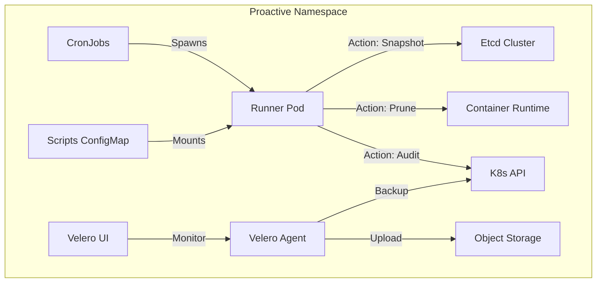

# Proactive Management Suite

## Table of Contents
1. [Overview](#1-overview)
2. [Design Philosophy](#2-design-philosophy)
    - [Problem Statement](#21-problem-statement)
    - [Goals & Non-Goals](#22-goals-and-non-goals)
    - [Minimal Architecture](#23-minimal-architecture)
3. [Architecture & Flow](#3-architecture--flow)
    - [System Design](#31-system-design)
    - [Execution Flow](#32-execution-flow)
4. [Velero & Backup Configuration](#4-velero--backup-configuration)
    - [Using MinIO (Default)](#41-using-minio-default)
    - [Using AWS S3 (Production)](#42-using-aws-s3-production)
    - [Velero UI Details](#43-velero-ui-details)
5. [Scenario Deep Dive (1-5: Stability)](#5-scenario-deep-dive-1-5-stability)
    - [1. Etcd Snapshot (Disaster Recovery)](#1-etcd-snapshot-disaster-recovery)
    - [2. Rolling Etcd Defrag (Performance)](#2-rolling-etcd-defrag-performance)
    - [3. Node Cleaner (Disk Hygiene)](#3-node-cleaner-disk-hygiene)
    - [4. Stuck Namespaces (Governance)](#4-stuck-namespaces-governance)
    - [5. Empty Services (Configuration Audit)](#5-empty-services-configuration-audit)
6. [Scenario Deep Dive (6-10: Hygiene & Audits)](#6-scenario-deep-dive-6-10-hygiene--audits)
    - [6. Pod Hygiene (Eviction Cleanup)](#6-pod-hygiene-eviction-cleanup)
    - [7. Certificate Expiry Check (Security)](#7-certificate-expiry-check-security)
    - [8. GPU Capacity Reporting (Observability)](#8-gpu-capacity-reporting-observability)
    - [9. Orphaned PVCs (Cost/Storage)](#9-orphaned-pvcs-coststorage)
    - [10. High Restart Analysis (Stability)](#10-high-restart-analysis-stability)
7. [Operational Standards](#7-operational-standards)
8. [Maintenance Mode](#8-maintenance-mode)
9. [Troubleshooting Guide](#9-troubleshooting-guide)

---

## 1. Overview
The **Proactive Management Suite** applies "Infrastructure-as-Code" principles to routine cluster maintenance. Instead of ad-hoc runbooks, we use Kubernetes **CronJobs** to schedule, execute, and audit maintenance tasks.
**Audience**: Platform Engineers operating fixed-size, on-prem Kubernetes fleets (especially GPU clusters) where reliability is paramount.

---

## 2. Design Philosophy

### 2.1 Problem Statement
Kubernetes clusters accumulate "entropy" over time:
*   **Etcd Database**: Grows with every write/delete, leading to fragmentation and slow API responses.
*   **Disk Pressure**: Unused Docker images and temporary files fill up root filesystems, causing node NotReady states.
*   **Stale Artifacts**: Evicted pods, hanging namespaces, and orphaned PVCs clutter the API and consume quotas.
*   **Configuration Drift**: Certificates expire, and Autoscalers drift from optimal settings.

Ad-hoc human intervention is error-prone and hard to audit. This suite solves this by automating the "Janitor" role.

### 2.2 Goals and Non-Goals
**Goals**:
*   **Minimalism**: One namespace (`proactive-maintenance`), standard K8s objects (CronJobs), GitOps managed.
*   **Safety**: Strict concurrency controls (Forbid overlap), active deadlines, and resource quotas.
*   **Auditability**: Every run produces a persistent Pod log and K8s Events.
*   **Observability**: Success/Failure metrics exported to Prometheus via `kube-state-metrics`.

**Non-Goals**:
*   **Self-Healing**: This suite *reports* or *cleans* safe targets. It does not reboot nodes (see Reactive Suite).
*   **Autoscaling**: It does not change fleet capacity (HPA/VPA only audited).

### 2.3 Minimal Architecture
*   **Execution Plane**: Kubernetes CronJobs spawning runner Pods.
*   **Logic Plane**: Bash/Python scripts stored in `ConfigMaps` (hot-reloadable).
*   **Data Plane**: MinIO (or S3) for storing backups/reports.
*   **Identity**: Scoped ServiceAccounts for each task (Least Privilege).

---

## 3. Architecture & Flow

### 3.1 System Design


### 3.2 Execution Flow
Robust error handling is built into the runner scripts:
1.  **Trigger**: Cron schedule fires.
2.  **Concurrency Check**: If previous job is running? **Skip** (`concurrencyPolicy: Forbid`).
3.  **Preflight**: Pod starts. Checks API connectivity.
4.  **Execution**: Script runs.
    *   *Success*: Exit 0. Logs "COMPLETED".
    *   *Failure*: Exit 1. Logs "ERROR". K8s retries (BackoffLimit).
5.  **Alerting**: Prometheus fires `JobFailed` alert if backoff exhausted.

---

## 4. Velero & Backup Configuration

### 4.1 Using MinIO (Default)
For offline/air-gapped environments, we ship a local MinIO instance.
*   **Service**: `minio.proactive-maintenance.svc`
*   **Port**: 9000 (API), 9001 (Console)
*   **Backup Bucket**: `velero`
*   **Credentials**: Defined in `velero-minio-creds` Secret.

### 4.2 Using AWS S3 (Production)
To promote this environment to production usage with AWS S3:
1.  **Credentials**: Edit `velero-secret` to replace MinIO keys with AWS IAM User Access/Secret keys.
2.  **Deployment Config**: Update the Velero Deployment arguments:
    *   `--backup-location-config region=us-east-1` (Replace with your region).
    *   Remove `s3Url` and `s3ForcePathStyle` overrides.
3.  **Verification**: Run `velero backup create test --from-schedule` to verify connectivity.

### 4.3 Velero UI Details
*   **Dashboard**: A lightweight web UI (`otwld/velero-ui`) tracks backup success rates and allows one-click restores.
*   **Internal URL**: `http://velero-ui.proactive-maintenance.svc:80`
*   **Backend Port**: Listens on container port **3000** (Service maps 80->3000).
*   **Auth**: Default is `admin` / `admin`.

---

## 5. Scenario Deep Dive (1-5: Stability)

### 1. Etcd Snapshot (Disaster Recovery)
*   **Purpose**: The ultimate safety net. If the cluster state is corrupted, this snapshot can restore the entire Control Plane.
*   **Schedule**: **Daily @ 01:00 UTC**.
*   **Technical Implementation**:
    *   Uses `etcdctl snapshot save`.
    *   Mounts the host's `/var/lib/etcd` or connects via mTLS certificates mounted from `/etc/kubernetes/pki`.
    *   Saves file to `/backup/etcd-snapshot-YYYYMMDD.db`.
    *   **Retention**: Runs `find /backup -type f -mtime +7 -delete` to prevent disk exhaustion.
*   **Verification**:
    ```bash
    kubectl create job --from=cronjob/daily-etcd-snapshot manual-snap -n proactive-maintenance
    kubectl logs job/manual-snap -n proactive-maintenance
    # Expected Output: "Snapshot saved to ...", "Retention cleanup complete."
    ```
*   **Failure Modes**:
    *   *Disk Full*: Check MinIO/PVC usage.
    *   *Auth Error*: Check Etcd client certs validity.

### 2. Rolling Etcd Defrag (Performance)
*   **Purpose**: Etcd uses MVCC (Multi-Version Concurrency Control). Deleted keys are just marked as "free" but take up space. Heavy write/delete loads (like HPA or CI/CD) cause DB size to grow, slowing down the API. Defrag reclaims this space.
*   **Schedule**: **Daily @ 02:00 UTC**.
*   **Technical Implementation**:
    *   **Rolling Logic**:
        1.  Resolves all Etcd endpoints.
        2.  Identifies the **Leader**.
        3.  Defrags **Followers** first (sequentially).
        4.  Defrags **Leader** last.
    *   Pauses 10s between members to allow cluster stabilization.
*   **Verification**:
    ```bash
    kubectl create job --from=cronjob/etcd-defrag-rolling manual-defrag -n proactive-maintenance
    # Expected Output: "Defragging member https://10.0.0.1:2379...", "Finished."
    ```

### 3. Node Cleaner (Disk Hygiene)
*   **Purpose**: Preventive maintenance for `DiskPressure`. Docker images and temporary files are the #1 cause of node failures in CI environments.
*   **Schedule**: **Daily @ 04:00 UTC**.
*   **Technical Implementation**:
    *   **Image Pruning**: Executes `crictl rmi --prune` (or `docker system prune -f`). Removes dangling images first, then unused images > 24h old.
    *   **Temp Cleanup**: Scans `/tmp` for files with `atime` (access time) > 10 days and deletes them.
*   **Verification**:
    ```bash
    kubectl create job --from=cronjob/daily-node-cleaner manual-clean -n proactive-maintenance
    # Expected Output: "Deleted: sha256:...", "Cleaned 45MB from /tmp"
    ```

### 4. Stuck Namespaces (Governance)
*   **Purpose**: Namespaces stuck in `Terminating` usually indicate a broken Finalizer (often unable to delete a PVC or LoadBalancer). They block resource quotas.
*   **Schedule**: **Daily @ 05:00 UTC**.
*   **Technical Implementation**:
    *   Queries `kubectl get ns`.
    *   Filters JSON for `.status.phase == "Terminating"`.
    *   Checks if `metadata.deletionTimestamp` is > 1 hour ago.
    *   Logs CRITICAL warning if found.
*   **Verification**:
    ```bash
    # Spec Log:
    # "WARNING: Namespace 'dev-team-a' is stuck Terminating since 2025-10-01"
    ```

### 5. Empty Services (Configuration Audit)
*   **Purpose**: Services with no Endpoints fail silently for clients (Connection Refused). Common cause: Selector mismatch or Pods crashing.
*   **Schedule**: **Daily @ 06:00 UTC**.
*   **Technical Implementation**:
    *   Queries all `Endpoints` objects in the cluster.
    *   Iterates to find objects where `subsets` is `null` (empty).
    *   Filter: Ignored `kubernetes` default service.
*   **Verification**:
    ```bash
    # Spec Log:
    # "WARNING: Service 'backend-api' in namespace 'prod' has 0 endpoints."
    ```

---

## 6. Scenario Deep Dive (6-10: Hygiene & Audits)

### 6. Pod Hygiene (Eviction Cleanup)
*   **Purpose**: Nodes under pressure (Memory/Disk) "Evict" pods. These pods stay in the API server forever as "Failed", cluttering `kubectl get pods`.
*   **Schedule**: **Hourly (:00)**.
*   **Technical Implementation**:
    *   **Target 1**: Pods with `status.reason == "Evicted"`. Action: `kubectl delete`.
    *   **Target 2**: Pods with `deletionTimestamp != null` (Terminating) for > gracePeriod. Action: `kubectl delete --force`.
*   **Verification**:
    ```bash
    kubectl create job --from=cronjob/hourly-pod-hygiene manual-hygiene -n proactive-maintenance
    # Expected: "Deleted pod default/evicted-pod-abc"
    ```

### 7. Certificate Expiry Check (Security)
*   **Purpose**: Prevents the dreaded "Cluster Locked Out" scenario where Control Plane certs expire.
*   **Schedule**: **Hourly (:30)**.
*   **Technical Implementation**:
    *   Mounts Host Path `/etc/kubernetes/pki`.
    *   Loop: For each `.crt` file.
    *   Command: `openssl x509 -in $file -noout -enddate`.
    *   Logic: If expiry date - current date < 30 days -> **Log ERROR/Alert**.
*   **Verification**:
    ```bash
    # Expected: "checked apiserver.crt: OK (expires in 350 days)"
    ```

### 8. GPU Capacity Reporting (Observability)
*   **Purpose**: On-prem GPU resources are expensive. We need to track aggregation vs allocation to detect "stranded" capacity (fragmentation).
*   **Schedule**: **Hourly (:15)**.
*   **Technical Implementation**:
    *   Queries `kubectl get nodes -l accel=nvidia`.
    *   Sum: `.status.allocatable."nvidia.com/gpu"`.
    *   Sum: `.status.capacity."nvidia.com/gpu"`.
    *   Report: Prints Cluster-wide utilization %.
*   **Verification**:
    ```bash
    # Spec Log:
    # Node          | GPU Alloc | GPU Cap
    # gpu-worker-01 | 4         | 8
    # gpu-worker-02 | 8         | 8
    # Total Utilization: 75%
    ```

### 9. Orphaned PVCs (Cost/Storage)
*   **Purpose**: `PersistentVolumeClaims` that are `Lost` or `Released` (but not deleted) consume expensive SAN/StorageClass resources.
*   **Schedule**: **Weekly (Sunday)**.
*   **Technical Implementation**:
    *   Queries `kubectl get pvc --all-namespaces`.
    *   Filters: `.status.phase` in `["Lost", "Released"]`.
    *   Action: Log Warning for manual cleanup.
*   **Verification**:
    ```bash
    # Spec Log:
    # "WARNING: PVC 'mysql-data' in 'db-ns' is LOST. Volume ref: pvc-1234..."
    ```

### 10. High Restart Analysis (Stability)
*   **Purpose**: CrashLooping pods are often ignored if they are not critical, but they consume CPU/Time and fill logs. This report highlights the "Top Offenders".
*   **Schedule**: **Hourly (:00)**.
*   **Technical Implementation**:
    *   Queries `kubectl get pods --all-namespaces`.
    *   Sorts (descending) by `.status.containerStatuses[].restartCount`.
    *   Head: Takes top 20.
*   **Verification**:
    ```bash
    # Spec Log:
    # NAMESPACE   POD             RESTARTS
    # payment     auth-svc-x8s    543
    # kube-sys    coredns-d8s     21
    ```

---

## 7. Operational Standards
All CronJobs deployed in this suite adhere to the following safety profile to prevent "Maintenance Storms":
1.  **Concurrency**: `Forbid`. A job is never skipped if resources are available, but strictly never double-scheduled.
2.  **Deadline**: `1800s`. Every maintenance task must finish in 30 minutes or it is considered "Hung" and killed.
3.  **History**: Keep 1 Success (audit trail), Keep 3 Failures (debugging history).
4.  **Priority**: `system-cluster-critical` is **NOT** used. Maintenance yields to workload.

---

## 8. Maintenance Mode
Typically, proactive maintenance should run on all nodes. However, if a node is under investigation or hardware replacement, you can **Exempt** it from operations like `Node Cleaner` or `Defrag` (if running locally).
*   **Action**: `kubectl label node <node-name> maintenance.mode=true`
*   **Result**: Scripts will check this label and `exit 0` immediately for that specific node logic.

---

## 9. Troubleshooting Guide
*   **Job Failed (Exit 1)**:
    *   Check Logs: `kubectl logs job/<job-name> -n proactive-maintenance`.
    *   Common Cause: RBAC Deny (Check Role/ClusterRole), API Timeout (Check Control Plane load).
*   **Job Stuck (Pending)**:
    *   Common Cause: Resource Quotas in `proactive-maintenance` namespace.
*   **Velero Crashing**:
    *   Common Cause: MinIO credential mismatch or MinIO pod not verified running.
