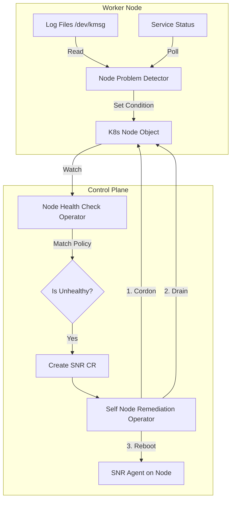

# Reactive Management Suite

## Table of Contents
1. [Overview](#1-overview)
2. [Design Philosophy](#2-design-philosophy)
    - [Executive Summary](#21-executive-summary)
    - [Constraints & Principles](#22-constraints--principles)
    - [Signal Taxonomy](#23-signal-taxonomy)
3. [Architecture & Flow](#3-architecture--flow)
    - [System Design](#31-system-design)
    - [Remediation State Machine](#32-remediation-state-machine)
4. [Recover vs Reboot Policies](#4-recover-vs-reboot-policies)
5. [Scenario Deep Dive (1-4: Kernel & Storage)](#5-scenario-deep-dive-1-4-kernel--storage)
    - [1. NodeNotReady (Heartbeat Failure)](#1-nodenotready-heartbeat-failure)
    - [2. KernelDeadlock (OS Freeze)](#2-kerneldeadlock-os-freeze)
    - [3. ReadonlyFilesystem (Corruption)](#3-readonlyfilesystem-corruption)
    - [4. CorruptDockerOverlay2 (Storage Driver)](#4-corruptdockeroverlay2-storage-driver)
6. [Scenario Deep Dive (5-8: Runtime & Services)](#6-scenario-deep-dive-5-8-runtime--services)
    - [5. FrequentKubeletRestart (Service Flap)](#5-frequentkubeletrestart-service-flap)
    - [6. FrequentContainerdRestart (Runtime Flap)](#6-frequentcontainerdrestart-runtime-flap)
    - [7. FrequentDockerRestart (Daemon Flap)](#7-frequentdockerrestart-daemon-flap)
    - [8. PLEGIsNotHealthy (Runtime Freeze)](#8-plegisnothealthy-runtime-freeze)
7. [Scenario Deep Dive (9-11: Infra & Network)](#7-scenario-deep-dive-9-11-infra--network)
    - [9. NetworkUnavailable (CNI Failure)](#9-networkunavailable-cni-failure)
    - [10. SystemOOM (Memory Pressure)](#10-systemoom-memory-pressure)
    - [11. Ext4Error (Filesystem Error)](#11-ext4error-filesystem-error)
8. [Maintenance Mode](#8-maintenance-mode)
9. [Operator Verification & Troubleshooting](#9-operator-verification--troubleshooting)

---

## 1. Overview
The **Reactive Management Suite** is the cluster's "Immune System". It detects unhealthy node conditions that K8s itself cannot resolve (e.g., Kernel Deadlocks, Read-Only Filesystems) and performs automated remediation—primarily **Rebooting** the node to restore it to a clean state.
**Namespace**: `reactive-maintenance`
**Stack**: Medik8s (`NodeHealthCheck`, `SelfNodeRemediation`) + Node Problem Detector.

---

## 2. Design Philosophy

### 2.1 Executive Summary
In managed clouds (EKS/GKE), unhealthy nodes are "Terminated" and replaced by Auto Scaling Groups. In an **on-prem, fixed-size fleet** (especially with GPU nodes), you cannot simply "delete" a node. You must repair it.
This system closes the loop: **Detect -> Drain -> Reboot -> Recover**.

### 2.2 Constraints & Principles
*   **Fixed Fleet**: We prioritize **availability**. We use `minHealthy` budgets to ensure we never reboot more than 1 node (or 5% of fleet) simultaneously.
*   **GPU Sensitivity**: GPU jobs are expensive to interrupt. Where possible, we attempt **Cordon & Drain** (Graceful Termination) before forced reboot.
*   **Auditability**: Every remediation is a Custom Resource (CR) in Kubernetes. history is preserved.
*   **Safety**: If the control plane cannot decide (Split Brain), we default to **NO ACTION** to prevent mass reboots.

### 2.3 Signal Taxonomy
We classify failures into three tiers:
1.  **Software/Service**: Kubelet dying, Docker crashing. *Action: Restart Service or Reboot.*
2.  **OS/Kernel**: Deadlocks, OOM Storms, Filesystem RO. *Action: Immediate Reboot.*
3.  **Hardware**: ECC Errors, NVMe Failures. *Action: Cordon & Alert (Manual fix).* (Note: This specific implementation focuses on Software/OS remediation).

---

## 3. Architecture & Flow

### 3.1 System Design
The pipeline works by translating low-level Linux signals into Kubernetes API Status conditions.



### 3.2 Remediation State Machine
The remediation process is a strict state machine to prevent data loss.

1.  **Detection**: Condition matches (e.g., `KernelDeadlock=True`) for `duration > 5m`.
2.  **Safety Check**: Is `minHealthy` (51%) satisfied? If no, **PAUSE**.
3.  **Cordon**: Mark node unschedulable.
4.  **Drain**: Evict all pods (respecting PDBs). Timeout: 5m.
5.  **Reboot**: Trigger hardware/software watchdog or `systemctl reboot`.
6.  **Recovery**: Wait for Node to report `Ready=True`.
7.  **Uncordon**: Add node back to pool.

---

## 4. Recover vs Reboot Policies
Why reboot?
*   **Memory Leaks**: A reboot is the only 100% reliable way to clear fragmented RAM/Slab.
*   **Stuck Mounts**: `EIO` (Input/Output errors) on NFS/Ceph mounts often require a kernel restart to clear locks.
*   **Driver Errors**: NVIDIA GPU driver "XID" errors often leave the GPU in a zombie state until reset (Reboot is safest).

**Policy**: We define ONE `NodeHealthCheck` resource that targets all worker nodes and reacts to the 11 scenarios below with a **Reboot** action. Details can be tuned per scenario.

---

## 5. Scenario Deep Dive (1-4: Kernel & Storage)

### 1. NodeNotReady (Heartbeat Failure)
*   **The Signal**: The Kubelet has failed to update its `status` field in the API server for `300s` (5 minutes).
*   **Root Causes**: Network partition, Kubelet crash, High CPU starvation (Load > 100).
*   **Remediation Action**: **Reboot**. (Assumes restarting the OS will fix the hung Kubelet or reconnect the network).
*   **Verification**:
    ```bash
    # Simulation: Stop kubelet service
    systemctl stop kubelet
    # Wait 5m. Check for remediation.
    ```

### 2. KernelDeadlock (OS Freeze)
*   **The Signal**: The kernel detector scans `/dev/kmsg` (kernel ring buffer). Pattern: `task blocked for more than 120 seconds`.
*   **Root Causes**: Buggy drivers, NFS hangs, infinite loops in kernel space.
*   **Remediation Action**: **Reboot**. (A locked kernel cannot recover itself).
*   **Verification**:
    ```bash
    # Simulation: Inject fake kernel log
    echo "kernel: task blocked for more than 120 seconds" > /dev/kmsg
    ```

### 3. ReadonlyFilesystem (Corruption)
*   **The Signal**: The kernel remounts the root filesystem as RO to protect data when it detects physical errors. Pattern: `Remounting filesystem read-only`.
*   **Root Causes**: Bad disk controller, loose cable, SSD wear-out, filesystem metadata corruption.
*   **Remediation Action**: **Reboot**. (Force `fsck` at boot to attempt repair).
*   **Verification**:
    ```bash
    # Simulation
    echo "kernel: Remounting filesystem read-only" > /dev/kmsg
    ```

### 4. CorruptDockerOverlay2 (Storage Driver)
*   **The Signal**: Docker/Containerd fails to start containers. Log pattern: `failed to register layer: applyLayer: invalid diffID`.
*   **Root Causes**: Corruption in `/var/lib/docker/overlay2`, often due to ungraceful power loss.
*   **Remediation Action**: **Reboot**. (Often clears temporary lock files or triggers XFS repair).
*   **Verification**:
    ```bash
    # Simulation: Inject log via logger (to syslog/journald)
    logger "docker: failed to register layer: applyLayer: invalid diffID"
    ```

---

## 6. Scenario Deep Dive (5-8: Runtime & Services)

### 5. FrequentKubeletRestart (Service Flap)
*   **The Signal**: Systemd Monitor detects `kubelet.service` failing/restarting > 5 times in 5 minutes.
*   **Root Causes**: Misconfiguration, OOM Killing of Kubelet process.
*   **Remediation Action**: **Reboot**.
*   **Verification**:
    ```bash
    # Loop restart
    for i in {1..6}; do systemctl restart kubelet; sleep 10; done
    ```

### 6. FrequentContainerdRestart (Runtime Flap)
*   **The Signal**: Systemd Monitor detects `containerd.service` flapping.
*   **Root Causes**: Corrupt image store, resource starvation.
*   **Remediation Action**: **Reboot**.
*   **Verification**:
    ```bash
    for i in {1..6}; do systemctl restart containerd; sleep 10; done
    ```

### 7. FrequentDockerRestart (Daemon Flap)
*   **The Signal**: Systemd Monitor detects `docker.service` flapping (Legacy nodes).
*   **Remediation Action**: **Reboot**.
*   **Verification**:
    ```bash
    for i in {1..6}; do systemctl restart docker; sleep 10; done
    ```

### 8. PLEGIsNotHealthy (Runtime Freeze)
*   **The Signal**: "Pod Lifecycle Event Generator". Kubelet log matches `PLEG is not healthy`.
*   **Root Causes**: The Container Runtime is too slow to respond to Kubelet queries (e.g., `runc` taking > 3m to inspect a container). High Load.
*   **Remediation Action**: **Reboot**. (Clears stuck `runc` processes).
*   **Verification**:
    ```bash
    # Inject fake Kubelet log
    echo "kubelet: PLEG is not healthy" > /dev/kmsg
    ```

---

## 7. Scenario Deep Dive (9-11: Infra & Network)

### 9. NetworkUnavailable (CNI Failure)
*   **The Signal**: The node status condition `NetworkUnavailable` is set to `True`.
*   **Root Causes**: CNI Plugin (Calico/Cilium) crash, IP Address exhaustion, Route table corruption.
*   **Remediation Action**: **Reboot**. (Resets network stack and CNI pods).
*   **Verification**:
    ```bash
    # Advanced: Requires patching Node Status directly via API.
    # kubectl patch node <name> -p '{"status":{"conditions":[{"type":"NetworkUnavailable","status":"True"}]}}'
    ```

### 10. SystemOOM (Memory Pressure)
*   **The Signal**: Kernel OOM Killer is active. Log: `Out of memory: Kill process`.
*   **Root Causes**: Application memory leak, insufficient Swap (Swap is usually disabled in K8s).
*   **Remediation Action**: **Reboot**. (Only way to guarantee fresh memory state).
*   **Verification**:
    ```bash
    echo "kernel: Out of memory: Kill process" > /dev/kmsg
    ```

### 11. Ext4Error (Filesystem Error)
*   **The Signal**: Specific EXT4 driver error. Log: `EXT4-fs error`.
*   **Detects**: Inconsistencies in inodes/superblocks.
*   **Remediation Action**: **Reboot**.
*   **Verification**:
    ```bash
    echo "kernel: EXT4-fs error" > /dev/kmsg
    ```

---

## 8. Maintenance Mode
In production, you often need to perform hardware maintenance (BIOS updates, RAM replacement) without triggering the Self-Healing watchdog.

**Procedure**:
1.  **Enter Mode**:
    ```bash
    kubectl label node worker-gpu-01 maintenance.mode=true
    ```
2.  **Verify**:
    The `NodeHealthCheck` resource has a `matchExpressions` selector that **Excludes** nodes with `maintenance.mode In [true]`.
3.  **Perform Work**:
    Safe to stop Kubelet, reboot manually, or disconnect network. No automated remediation will fire.
4.  **Exit Mode**:
    ```bash
    kubectl label node worker-gpu-01 maintenance.mode-
    ```

---

## 9. Operator Verification & Troubleshooting

### 9.1 Verification Commands
Check that all agents are running:
```bash
# 1. Operators
kubectl get pods -n reactive-maintenance
# Expect: nhc-operator, nmo-operator, snr-operator

# 2. Agents (One per node)
kubectl get ds -n reactive-maintenance
# Expect: reactive-node-problem-detector

# 3. Policy
kubectl get nodehealthcheck
# Expect: 1 Policy targeting "all nodes" (or specific pool).
```

### 9.2 Troubleshooting Analysis
*   **Node Rebooted unexpectedly?**
    Check events:
    ```bash
    kubectl get events -n reactive-maintenance --sort-by='.lastTimestamp'
    # Look for "RemediationCreated" or "Reboot Triggered"
    ```
*   **Remediation Stuck?**
    Check if `minHealthy` blocked it.
    ```bash
    kubectl describe nodehealthcheck
    # Look for "RemediationAllowed: False"
    ```
*   **NPD not detecting logs?**
    Verify paths.
    ```bash
    kubectl logs -l app=reactive-node-problem-detector -n reactive-maintenance
    # Ensure it says "Log path: /var/log/..." and not "No such file".
    ```
